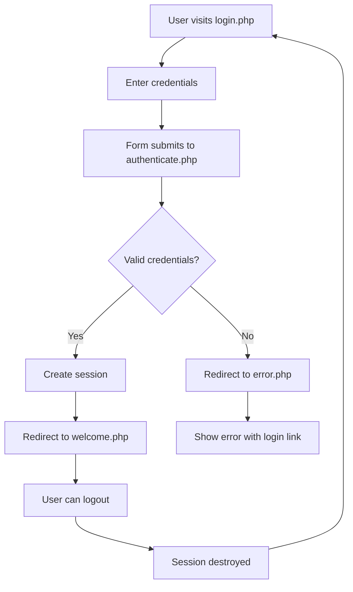

# 🔐 PHP Login System

A complete, secure PHP login system with user authentication, database integration, and modern UI design. Perfect for learning PHP fundamentals and building authentication systems.


## ✨ Features

- 🔒 **Secure Login Form**: HTML form with modern, responsive styling
- 🗄️ **Database Authentication**: Connects to MySQL database to verify user credentials
- 🛡️ **Password Security**: Uses PHP's `password_hash()` and `password_verify()` functions
- 📊 **Session Management**: Maintains secure user sessions across pages
- ⚠️ **Error Handling**: Shows appropriate error messages with redirect links
- 🎉 **Welcome Page**: Displays personalized welcome message after successful login
- 🚪 **Logout Functionality**: Secure session destruction and cleanup

## 📁 Project Structure

```
PhpLearning/
├── 📄 config.php         # Database configuration and connection
├── 🔑 login.php          # Login form with modern styling
├── 🔍 authenticate.php   # Handles login authentication logic
├── 🏠 welcome.php        # Welcome page for authenticated users
├── ❌ error.php          # Error page with redirect link to login
├── 🚪 logout.php         # Handles user logout
├── ⚙️ setup.php          # Database and table creation with sample users
└── 📖 README.md          # This file
```

## 🚀 Quick Start

### Prerequisites

- XAMPP, WAMP, or any local web server with PHP support
- MySQL database server
- Web browser

### Installation

1. **📂 Clone or download** this project to your web server directory:
   ```
   c:\xampp\htdocs\PhpLearning\
   ```

2. **🖥️ Start your web server** (XAMPP, WAMP, or similar)

3. **🗄️ Start MySQL** service

4. **⚙️ Run the setup script** by navigating to:
   ```
   http://localhost/PhpLearning/setup.php
   ```

5. **🔑 Access the login page** at:
   ```
   http://localhost/PhpLearning/login.php
   ```

## 👥 Test Credentials

After running `setup.php`, you can use these test accounts:

| Username | Password | Role |
|----------|----------|------|
| `admin` | `admin123` | Administrator |
| `user1` | `password1` | Regular User |
| `testuser` | `test123` | Test User |

## ⚙️ Database Configuration

The system uses the following default database settings:

| Setting | Value |
|---------|-------|
| **Host** | `localhost` |
| **Database** | `user_auth` |
| **Username** | `root` |
| **Password** | *(empty)* |

> **💡 Note**: Modify `config.php` if your database settings are different.

## 🔒 Security Features

- 🔐 **Password Hashing**: Uses PHP's `password_hash()` function with strong algorithms
- 🛡️ **SQL Injection Prevention**: Prepared statements protect against SQL injection attacks
- 🔑 **Session-based Authentication**: Secure session management with proper cleanup
- ✅ **Input Validation**: Thorough validation and sanitization of user inputs
- ⚠️ **Error Handling**: Proper error handling without exposing sensitive information
- 🚫 **CSRF Protection**: Basic protection against cross-site request forgery

## 🔄 How It Works



### Detailed Flow:

1. 🌐 User navigates to `login.php` and sees the login form
2. 📝 User enters username and password
3. 📤 Form submits credentials to `authenticate.php`
4. 🔍 Script connects to database and verifies credentials using prepared statements
5. ✅ **If correct**: Creates session and redirects to `welcome.php`
6. ❌ **If incorrect**: Redirects to `error.php` with helpful error message
7. 🚪 Users can logout via `logout.php` to destroy session and return to login

## 🛠️ Troubleshooting

### Common Issues

**❌ Database Connection Error**
- Ensure MySQL service is running
- Check database credentials in `config.php`
- Verify the database `user_auth` exists (run `setup.php`)

**❌ Permission Denied**
- Check file permissions on your web server
- Ensure PHP has write access to session directory

**❌ Page Not Found**
- Verify your web server is running
- Check the correct URL path: `http://localhost/PhpLearning/`

### Debug Mode

To enable debug mode, add this to your `config.php`:
```php
ini_set('display_errors', 1);
ini_set('display_startup_errors', 1);
error_reporting(E_ALL);
```

## 🎨 Customization

### Styling
- Modify the CSS in `login.php` to change the appearance
- Add your own logo or branding elements
- Customize colors and fonts to match your design

### Database Schema
- Extend the user table with additional fields (email, role, etc.)
- Add user registration functionality
- Implement password reset features

### Security Enhancements
- Add CAPTCHA for brute force protection
- Implement account lockout after failed attempts
- Add two-factor authentication (2FA)

## 📚 Learning Resources

This project demonstrates:
- PHP basics and syntax
- Database connectivity with PDO
- Session management
- Form handling and validation
- Basic web security principles

### Next Steps
- Add user registration
- Implement password reset
- Create user roles and permissions
- Add email verification
- Build a complete user management system

## 🤝 Contributing

Contributions are welcome! Please feel free to submit a Pull Request.

### Areas for Improvement
- [ ] Add user registration functionality
- [ ] Implement password reset feature
- [ ] Add email verification
- [ ] Create user roles and permissions
- [ ] Add CAPTCHA protection
- [ ] Implement rate limiting
- [ ] Add unit tests

## 📄 License

This project is open source and available under the [MIT License](LICENSE).

## 🆘 Support

If you have any questions or need help:
- Check the troubleshooting section above
- Review the code comments for implementation details
- Create an issue if you find a bug

---

**Happy Coding! 🚀**
